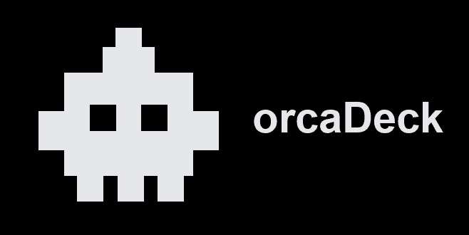
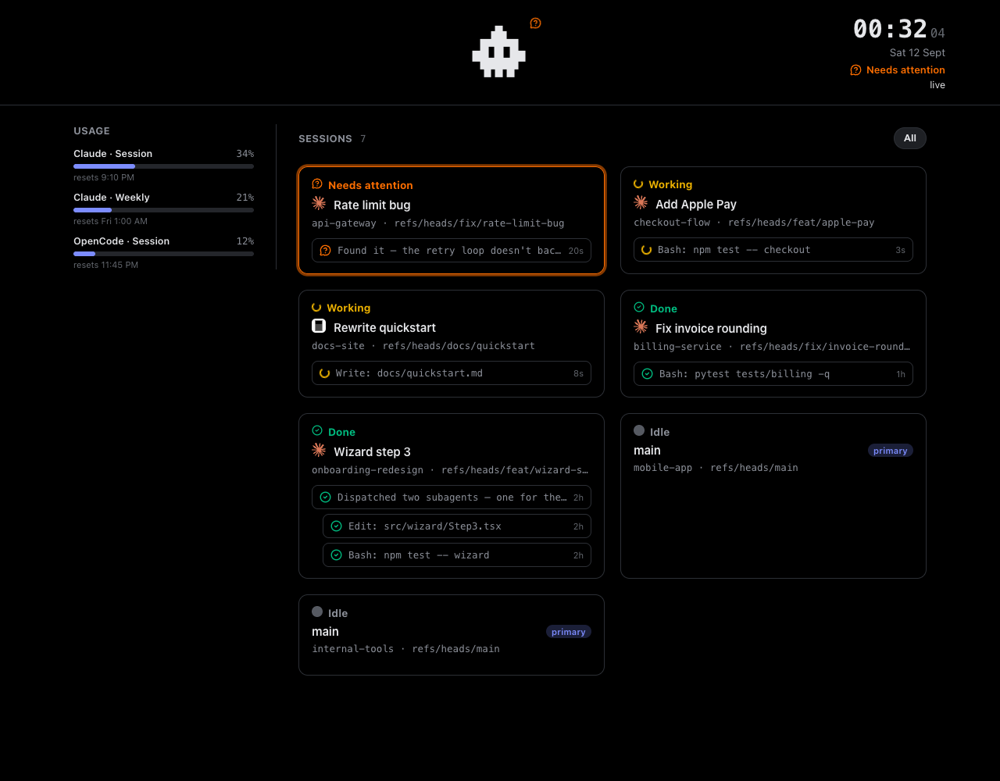

<p align="center">

</p>

<p align="center">

  <a href="LICENSE"></a>

  

  

</p>

A live panel of everything [Orca](https://orcaapp.dev) is running — every
worktree, agent, subagent, and harness — servable to any device on your LAN,
with the ability to reply into a session from there. The panel is built to
run on legacy WebKit too, all the way back to iOS 10 Safari — that old
tablet in a drawer can be a dashboard again.

<p align="center">

</p>

## Install and Usage

You need [Orca](https://orcaapp.dev) installed (`orca` on PATH) and Python
3.9+ — no other dependencies.

**CLI**

```
curl -fsSL https://raw.githubusercontent.com/moraisjose/orcaDeck/main/install.sh | sh
orcadeck serve
```

**Agent**

**Claude Code** — ask it to set up orcaDeck; the bundled `setup-orcadeck` skill checks prerequisites, starts the server, and hands you the URL to open on your other device.

## How it works

`orcad` polls `orca worktree ps` + `orca terminal list`, projects them into
one JSON document, and serves that plus the panel itself from one
process/port. Full design: [`docs/design.md`](docs/design.md).

## Props

A sibling to [Clawdeck](https://github.com/Dixie-sketch/Clawdeck), same
"small companion + polling panel" shape, sourced from Orca instead of Claude
Code's hooks, so it sees every harness Orca runs, not only Claude.