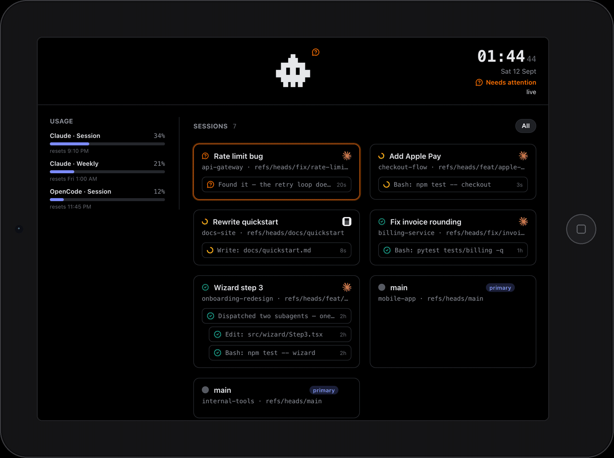

<p align="center">

</p>

<p align="center">
  <a href="LICENSE"></a>
  
</p>

A live panel of everything [Orca](https://www.onorca.dev) is running — every
worktree, agent, subagent, and harness — servable to any device on your LAN,
with the ability to reply into a session from there. The panel is built to
run on legacy WebKit too, all the way back to iOS 10 Safari — that old
tablet in a drawer can be a dashboard again.

<p align="center">

</p>

## Install and Usage

You need [Orca](https://www.onorca.dev) installed (`orca` on PATH) and Python
3.9+ — no other dependencies.

**CLI**

```
curl -fsSL https://raw.githubusercontent.com/moraisjose/orcaDeck/main/install.sh | sh
orcadeck serve
```

**Agent**

**Claude Code** — ask it to set up orcaDeck; the bundled `setup-orcadeck`
skill checks prerequisites, starts the server, and hands you the URL to open
on your other device.

## Use it

`orcadeck serve` prints a local and a LAN URL. Open the **LAN** one in that
device's browser once — the token pairs it — then bookmark the plain
`http://<ip>:8720/` from then on, or add it to its Home Screen. Tap **Reply**
on any session to send text straight into it.

## Security

`orcad` binds your LAN on purpose — that's how the iPad reaches the panel.
Anything on the network can read what it serves: the state feed (repo,
branch, and worktree names, agent prompts, last assistant messages, usage
readings) and the live terminal tail of a session, which can contain
whatever that terminal printed. Typing into a session — sending text or an
interrupt — is the only gated path, behind a token `orcad` generates on
first run (`~/.orcad/token`, chmod 600, shown once as a pairing URL). So:
run it on networks you trust — home or office, not the café — or set
`ORCAD_BIND=127.0.0.1` to keep it same-machine-only.

## How it works

`orcad` polls `orca worktree ps` + `orca terminal list`, projects them into
one JSON document, and serves that plus the panel itself from one
process/port. Full design: [`docs/design.md`](docs/design.md).

## Props

A sibling to [Clawdeck](https://github.com/Dixie-sketch/Clawdeck), same
"small companion + polling panel" shape, sourced from Orca instead of Claude
Code's hooks, so it sees every harness Orca runs, not only Claude.

orcaDeck is an independent project and is not affiliated with or endorsed by
Orca or the harness vendors; *Orca*, *Claude*, *Codex*, and *OpenCode* are
their respective owners' marks, named here only to say what the panel works
with.
